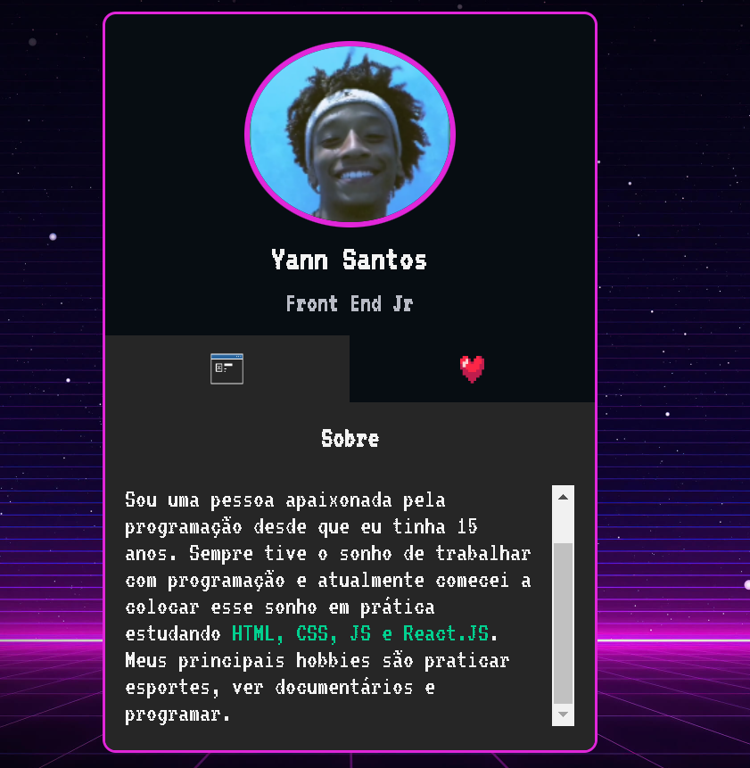
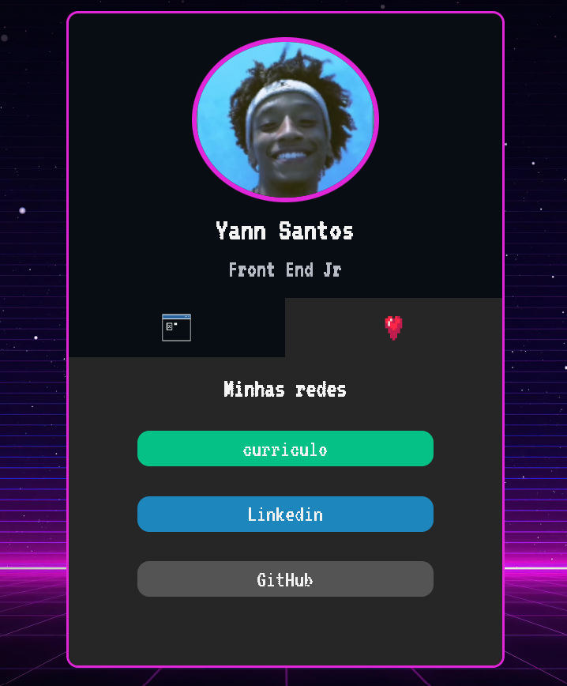

# Projeto Portfólio
* Este projeto portfólio tem como objetivo falar brevemente sobre mim, e,compartilhar minhas redes de programação e curriculo.

## Linguagens Utilizadas
* HTML
* CSS
* JavaScript

### Layout do Projeto
[
    <h2>Sessao Sobre:<h2>
    
    <h2>Sessao Minhas Redes:<h2>
    
]